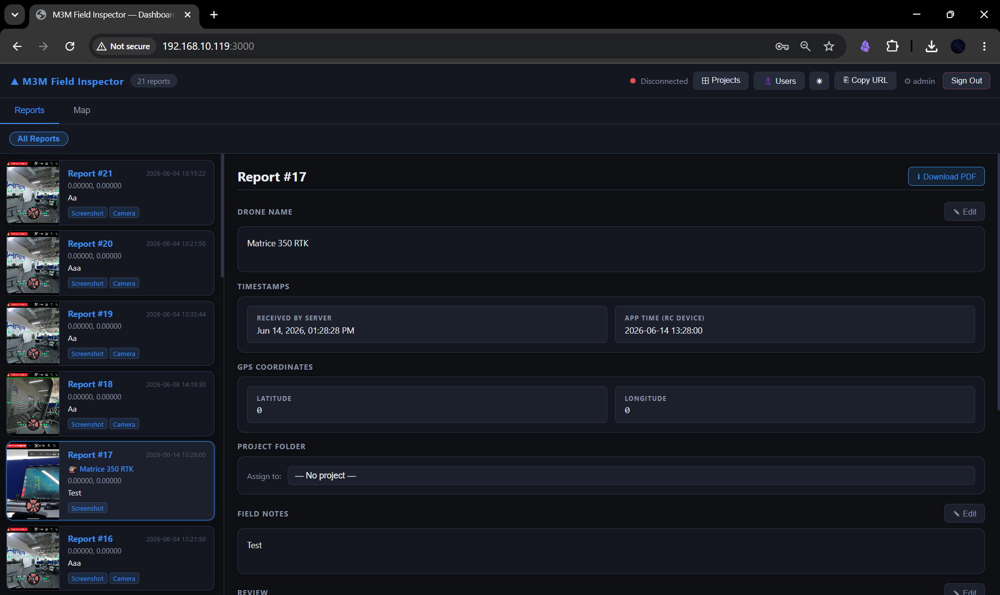

# M3M Field Inspector

> A custom Android field inspection app built for enterprise drone operations using DJI Mobile SDK V5.

---

## Overview

M3M Field Inspector is a mission-critical Android application built for drone field operators running DJI enterprise platforms. It replaces generic ground station apps with a purpose-built inspection workflow — capturing multispectral data, filing georeferenced reports mid-flight, and uploading them to a dashboard server over Wi-Fi.

Built for and deployed on the **DJI RC Pro Enterprise** remote controller, running **AOSP without Google Play Services**.

> **Note:** This repository is a project showcase. Source code is proprietary.

---

## Demo

📹 **Full app walkthrough available on request.**

---

## Supported Drone Platforms

| Drone | Payload / Feature |
|---|---|
| DJI Mavic 3 Multispectral (M3M) | Multispectral bands: G / R / RE / NIR / NDVI / RGB |
| DJI Matrice 350 RTK | Payload detection: Zenmuse H20T and others |
| DJI Mavic 3TD | Camera modes: Wide / Tele / Thermal |

---

## Key Features

### Live Flight Interface
- Full FPV video feed via DJI UXSDK
- Mini satellite map (MapLibre + Esri World Imagery tiles) — no Google Maps dependency
- Live flight mode badge: P-Mode, S-Mode, OPTI, etc.
- Drone-aware overlay showing active band, payload, or camera mode depending on connected platform

### Report Filing (Three Workflows)
**Standard (all drones)**
Tap the orange FAB mid-flight. MediaProjection captures the full RC screen (FPV + overlays). Report form opens pre-filled with the screenshot and GPS coordinates. Add notes, optionally pull the latest photo from the drone's SD card, and save.

**NDVI Capture (M3M only)**
Tap the green NDVI FAB while in the NDVI stream. The app simultaneously captures a live NDVI colormap frame from the camera stream and fires the drone shutter. After a 2-second SD card write delay, the report form opens with both the NDVI snapshot and the drone's RGB photo pre-filled automatically.

**Quick Capture (M350 only)**
Fires the drone shutter first, then takes the RC screenshot, then opens the report form with both slots pre-filled — no manual steps required.

### Report Management & Upload
- Local report list with long-press batch selection
- Batch upload to a dashboard server via Wi-Fi
- Each report ships as a multipart POST: JSON metadata + RC screenshot + drone photo
- Dashboard built collaboratively for report review and inspection history

---

## Technical Stack

| Layer | Technology |
|---|---|
| Language | Kotlin |
| Drone SDK | DJI MSDK V5 5.17.0 + UXSDK (local module) |
| Maps | MapLibre + Esri World Imagery CDN |
| Local Database | Room (v2 schema with migration) |
| Networking | OkHttp 4.x + RxJava 3 |
| GPS | Android LocationManager (no Google Play Services) |
| Screen Capture | Android MediaProjection API |
| NDVI Capture | DJI ICameraStreamManager |
| Drone Media | DJI MediaManager |
| Drone Keys | DJI KeyManager (FlightController, Camera, Product, Payload) |
| Architecture | MVVM — ViewModels + ActivityResultLauncher contracts |
| Build | AGP 8.x, Gradle Kotlin DSL, minSdk 26, targetSdk 34 |

---

## Engineering Challenges

### AOSP / No Google Play Services
The DJI RC Pro Enterprise runs Android without GMS. Every API that normally delegates to Google had to be replaced:
- **Maps:** MapLibre (Mapbox fork bundled in UXSDK) + Esri tile CDN instead of Google Maps
- **GPS:** Raw `LocationManager` instead of `FusedLocationProviderClient`
- No Firebase, Crashlytics, or Play distribution

### MediaProjection on AOSP
Screen capture requires a foreground `ScreenCaptureService` plus a transparent trampoline activity (`ScreenshotTrampolineActivity`) to manage the consent dialog lifecycle correctly. On non-GMS Android, the system silently refuses `MediaProjection` if the service isn't declared and started in the right order.

### Camera Stream Corruption (M350 + M3M)
`DefaultLayoutActivity`'s internal `availableCameraUpdatedListener` fires during `onPause()` while the `SurfaceView` is already detached, leaving the FPV widget's model and physical stream out of sync on resume. Fixed with an `onPause()` commit (`updateVideoSource()` before `super.onPause()`) and a 1-second resync on `onResume()`. M350 required an additional reordering of the quick-capture flow to shutter-first so all camera mode switches settle before any pause/resume cycle.

### DJI SDK Listener Leaks
MSDK key listeners registered with overlay views as their tag were never cancelled by `cancelListen(this)`, and `onDetachedFromWindow()` is skipped during activity teardown. Fixed with explicit `cancelListen(currentOverlay)` calls in `onDestroy()`.

### LocationManager Leak (API 29)
Using the activity context for `LocationManager` triggers a platform bug where `ContextImpl.mAutofillClient` holds the activity alive via a native binder. Fixed by obtaining the manager from `applicationContext` with a static `WeakReference` listener.

### DJI MediaManager Thumbnail Crash
Concurrent `pullThumbnailFromCamera()` calls during drone media selection caused crashes. Replaced thumbnails with static icons — stable with no functional loss, since filenames are sufficient for file selection.

---

## Dashboard

Reports filed in the field are uploaded to a web dashboard for review and inspection history. The dashboard was built collaboratively as part of the same project.

---

## Project Context

Built during an internship at a drone operations company in Muscat, Oman. Deployed on active field operations hardware. Development involved solo ownership of the Android application from architecture through to field testing, alongside collaborative work on the reporting dashboard.

---

## Contact

**Sanad Al Salmi**
[LinkedIn](https://linkedin.com/in/sanad-alsalmi) · [GitHub](https://github.com/ItsSanad) · alsalmisanad@gmail.com
